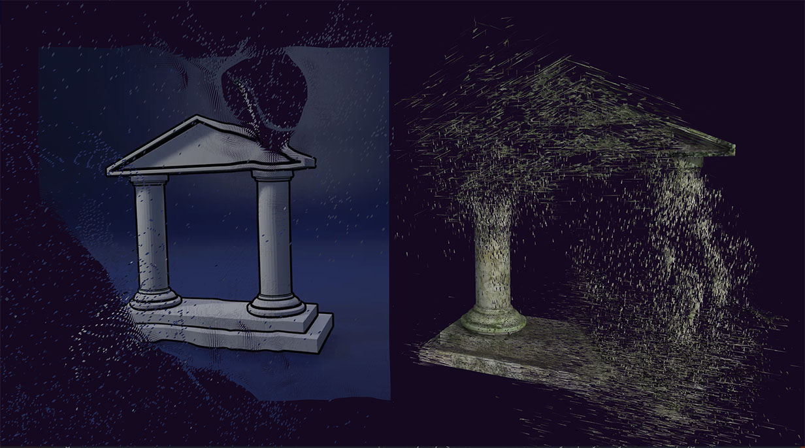

<h1 align="center">Morphing 2D Image to 3D Object using GPGPU and FlowField</h1>



## Description

This project demonstrates the morphing of a 2D image (mesh) into a 3D object using General-Purpose Computing on Graphics Processing Units (GPGPU). The GPGPU approach allows for efficient calculation of vertex transitions and flow fields, resulting in a visually compelling animation.

## Deployed Version

For live demo please visit 👉 https://2d-to-3d-morphing-flowfield-gpgpu.vercel.app/

## Project Features

- GPGPU-based flowfield calculation: The flowfield is calculated using GPGPU, which allows for efficient and parallel processing.
- Vertex animation based on flowfield: The vertices of the mesh are animated based on the flowfield, creating a smooth and dynamic transformation.
- User-controlled animation: The user can control the animation speed and numerous flowfield parameters.
- Free Flow Mode: Simulate free-flowing movement without morphing target influence.

## Technologies

The project uses the following technologies:

- Three.js for 3D WebGL rendering
- GPGPU: Efficient parallel processing on GPU.
- GLSL Shaders for custom graphical effects
- GSAP for robust and smooth animations
- lil-gui for an interactive GUI for controlling shader parameters
- Vite as a modern and fast build tool, configured to support GLSL
- Stats.js: Performance monitoring for web apps.

## Setup Instructions

Please follow these setup instructions to get the project running locally:

### Prerequisites

- Node.js installed on your system.

### Installation

Clone the repository and install dependencies:

```bash
git clone https://github.com/hkzone/2d-to-3d-morphing-flowfield-gpgpu.git
cd 2d-to-3d-morphing-flowfield-gpgpu
npm install
```

Run the development server:

```bash
npm run dev
```

Build for production:

```bash
npm run build
```

The production-ready files will be in the `dist/` folder.

## Presets

Each of the five animation presets is meticulously crafted to showcase various visuals made posible by powerfull variables customization.

## Uniforms

The shader uses several flowfield uniform variables to drive the animation logic.

### Uniforms Control

`lil-gui` is used to create a GUI for live interaction with shader uniforms. Press 'h' to toggle the controls visibility in the UI.

## Project Structure

- `src/script.js`: Main JavaScript entry point for setting up the project and controling the logic.
- `src/style.css`: Styles for the canvas and any HTML UI.
- `src/rendering.js`: Sets up the Three.js rendering.
- `src/utils.js`: Provides utility functions,
- `src/shaders/`: Directory containing GLSL shader files (`.glsl`).

## Debugging and Configuration

A series of commented lines are available to gpgpu mesh visualization for debugging.

## Contributing

If you'd like to contribute, please fork the repository, create a feature branch, and submit a pull request with your changes.

## License

This work is licensed under a Creative Commons Attribution-NonCommercial 4.0 International License. For more information, see `LICENSE` or visit [Creative Commons License](https://creativecommons.org/licenses/by-nc/4.0/)

## Social

Made By [Vitaliy Vlasyuk @_hkzone_](https://twitter.com/_hkzone_)

[Twitter](https://twitter.com/_hkzone_) - [Portfolio](https://vitaliyvlasyuk.com/) - [Github](https://github.com/hkzone)
